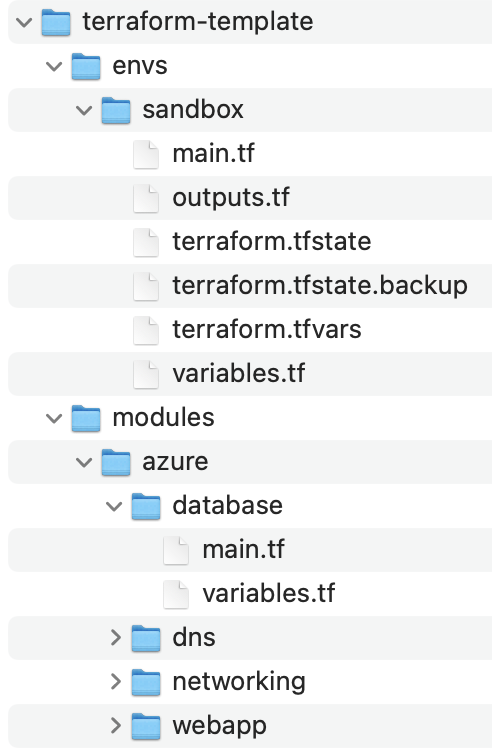

# terraform-template
We use Terraform to automate infrastructure on cloud.

## Terraform project structure


## Basic Terraform Commands
Run following commands in an environment, e.g., `envs/sandbox`.
### Init a Terraform project
```shell
terraform init
```
### Verify the configuration
```shell
terraform plan
```

### Create resources in a specified cloud
```shell
terraform apply
```
### Delete resources in the specified cloud
```shell
terraform destroy
```


## Azure Cloud
We defined Azure modules under `modules/azure`, and create those modules in the main module under `envs/`, e.g., `envs/sanbox`.

### Modules and resources
#### networking
We defined a `Virtual Network` and two subnets. One of the subnets is `Protected Subnet` which can be accessed from the internet in some conditions. The other subnet is `Private Subnet` which only could be accessed from the same Virtual network.

#### dns
We defined a `Private DNS Zone` for db. When creating a `Private Subnet`, we have to create a `Private DNS Zone`.

#### db
We defined a `PostgreSQL database` which can be used saved data for web applications.</br>
Note: We use `Key Vault` to store some db secret information. Make sure you create those secrets before running terraform commands. See TODO in `terraform.tfvars`

#### webapp
We defined a web application with container publishing model. We can configure CI/CD with `Git Actions` for the web application.</br>
Note: We use `Key Vault` to store some JWT information. Make sure you create those secrets before running terraform commands. See TODO in `terraform.tfvars`

#### Container repository
We defined a container repository to maintain the `docker images` generated from the `Git Actions`.

#### Key Vault Secret
We need to create a key Vault in the cloud and configure secrets manually. Then we import those secrets for webapp and db. </br>
After creating the key Vault, replace the key_vault_id. See TODO in `terraform.tfvars` </br>
Use the following command to find key_vault_id.
```shell
az keyvault show --name "mykeyvault"
```

#### Traffic manager
We defined a `Traffic Manager` to manage traffic.</br>
Note: Only webapp with sku:S1 and above are supported Traffic Manager
